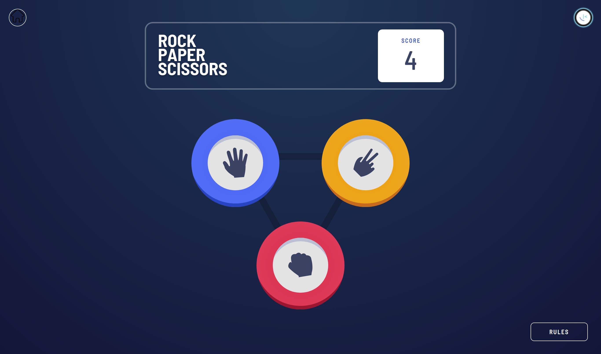

# Frontend Mentor - Rock, Paper, Scissors solution

This is a solution to the [Rock, Paper, Scissors challenge on Frontend Mentor](https://www.frontendmentor.io/challenges/rock-paper-scissors-game-pTgwgvgH). Frontend Mentor challenges help you improve your coding skills by building realistic projects. 

## Table of contents

- [Overview](#overview)
  - [Screenshot](#screenshot)
- [My process](#my-process)
  - [Built with](#built-with)
  - [Add on](#add-on)
- [Author](#author)

### Overview
 I enjoyed a lot while doing this.(^_^)

### Screenshot

.png)
.png)
.png)
.png)
.png)
.png)
.png)
.png)
.png)
.png)
.png)
.png)
.png)

## My process

### Built with
- Semantic HTML5 markup
- CSS custom properties
- Flexbox
- CSS Grid

### add-on
 I have coded a Main Game Selection interface to choose the game to play.^-^
 .png)
 I have include a home button to get back on homePage.

## Author

- Frontend Mentor - [@Vatukah](https://www.frontendmentor.io/profile/Vatukah)

